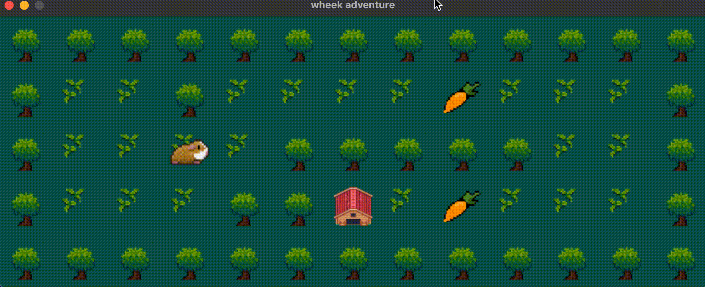
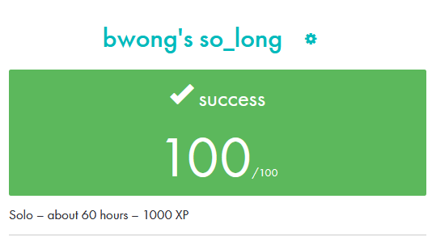

# so_long
a small 2D game created with minilibx in C

Requirement

## Game
• The player’s goal is to collect every collectible present on the map, then escape
chosing the shortest possible route.\
• The W, A, S, and D keys must be used to move the main character.\
• The player should be able to move in these 4 directions: up, down, left, right.\
• The player should not be able to move into walls.\
• At every move, the current number of movements must be displayed in the shell.\
• You have to use a 2D view (top-down or profile).\

## Game Preview

## Final Marks
